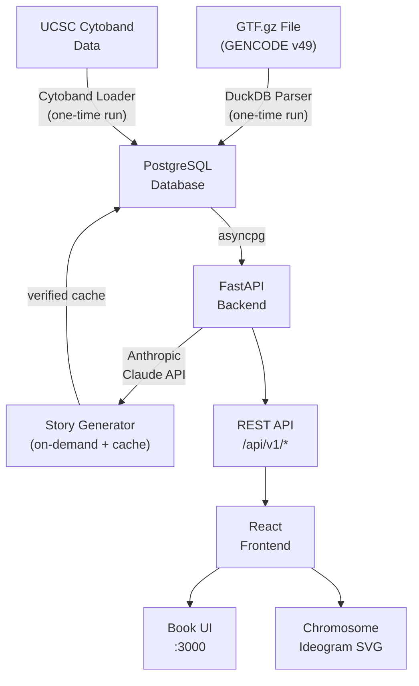

# Gene Story — System Architecture

> This document is automatically maintained by the Architecture Agent.
> It is updated after every git commit. Do not edit manually.

---

## System Overview



---

## Layers

### Layer 1 — Data

| Component | Technology | Purpose |
|-----------|-----------|---------|
| GTF Parser | Python + psycopg2 | Parses GENCODE annotation, loads genes into PostgreSQL |
| Cytoband Loader | Python + psycopg2 | Downloads G-band data from UCSC, populates cytobands table |
| PostgreSQL | postgres:16-alpine | Primary data store — genes, stories, cytobands, visits |

### Layer 2 — API

| Component | Technology | Purpose |
|-----------|-----------|---------|
| FastAPI app | Python 3.11 + uvicorn | REST API server, SSE streaming; listens on `$PORT` (Railway) or 8000 |
| Story Agent | anthropic SDK | Generates gene stories on demand, caches to DB |
| Cache Integrity Monitor | asyncio background task | Hourly check for uncached visited genes |

### Layer 3 — Frontend

| Component | Technology | Purpose |
|-----------|-----------|---------|
| React App | React 18 + Vite | Book-like UI, chapter list, reading view |
| ChromosomeIdeogram | Custom SVG | Draws chromosome bands, highlights gene position |
| SearchBar | React component | Gene name search with debounce |
| Nginx | nginx:alpine | Serves static files, proxies /api/* to backend; port and API URL substituted at startup via `docker-entrypoint.sh` |

### Layer 4 — Agents

| Agent | Trigger | Purpose |
|-------|---------|---------|
| Review Agent | Manual (`/review <file>`) | Plain-English code review, outputs REVIEW_REPORT.md |
| Architecture Agent | Git post-commit hook | Updates this document automatically after each commit |

---

## API Endpoints

| Method | Path | Description |
|--------|------|-------------|
| GET | `/health` | Server liveness check |
| GET | `/api/v1/chromosomes` | List all chromosomes with gene counts |
| GET | `/api/v1/chromosomes/{chr}/genes` | Paginated gene list for a chromosome |
| GET | `/api/v1/chromosomes/{chr}/cytobands` | Cytoband data for ideogram |
| GET | `/api/v1/genes/{gene_id}` | Single gene metadata |
| GET | `/api/v1/genes/{gene_id}/neighbours` | Previous and next genes on chromosome |
| GET | `/api/v1/genes/{gene_id}/story` | Cached story (404 if not yet generated) |
| GET | `/api/v1/genes/{gene_id}/story/stream` | Stream story via SSE (generates if needed) |
| GET | `/api/v1/genes/search?q=BRCA1` | Search genes by name |

---

## Database Schema

| Table | Key Columns | Purpose |
|-------|-------------|---------|
| `chromosomes` | name, length, gene_count | One row per chromosome |
| `cytobands` | chromosome, start_pos, end_pos, band_name, stain | G-band data for ideogram |
| `genes` | gene_id, gene_name, chromosome, start_pos, end_pos, strand, gene_type, exon_count, properties JSONB | All genes from GENCODE v49 |
| `gene_stories` | gene_id, story_text, verified, model_version | Cached LLM stories with verification |
| `story_errors` | gene_id, error_message, occurred_at | Audit log of generation failures |
| `gene_visits` | gene_id, visited_at | Visit tracking for integrity monitor |
| `bookmarks` | gene_id, note | User-saved gene bookmarks |

The `properties JSONB` column on `genes` is intentionally open-ended — future enrichment
(OMIM IDs, UniProt, GTEx expression, etc.) can be added without schema migrations.

The `genestory` application user is granted `ALL PRIVILEGES` on all tables and sequences in the
`public` schema. This is handled at the end of `db/init.sql`, since the superuser (`POSTGRES_USER`)
creates the tables and the app user requires explicit grants.

---

## Four-Layer Story Caching Guarantee

Stories are generated once and cached forever. The guarantee has four layers:

1. **Cache-first check** — return instantly if verified story exists (fast path)
2. **Per-gene lock + re-check** — asyncio.Lock prevents duplicate API calls
3. **Atomic write** — only write to DB after the full story is received (no partials)
4. **Read-back verification** — re-read from DB to confirm write was correct; mark `verified=TRUE`

A background integrity monitor runs hourly and reports any visited genes missing a verified story.

---

## Data Flow: First Visit to a Gene

```
Browser → GET /api/v1/genes/{id}/story/stream
         → API checks gene_stories table
         → No cached story found
         → Acquire per-gene asyncio.Lock
         → Re-check cache (inside lock)
         → Call Claude API (claude-sonnet-4-6)
         → Stream chunks → SSE → Browser (typewriter effect)
         → Full story assembled
         → INSERT into gene_stories (verified=FALSE)
         → SELECT back to verify content matches
         → UPDATE gene_stories SET verified=TRUE
         → Log success

Subsequent visits → Cache hit → instant return
```

---

## Proxy & Network Build Support

All three Dockerfiles (`api`, `parser`, `frontend`) accept `HTTP_PROXY`, `HTTPS_PROXY`, and
`NO_PROXY` as build arguments, forwarded from the host environment via `docker-compose.yml`.
This allows builds to succeed behind corporate or cloud proxies.

Key details:
- **Python images** (`api`, `parser`): proxy env vars are cleared after `pip install` so the
  running application is not affected. `pip` is also invoked with `--trusted-host` flags for
  environments where a proxy terminates TLS.
- **Node image** (`frontend`): `npm install` is run with `--strict-ssl=false` for the same reason.
- **Cytoband downloader** (`load_cytoband.py`): uses an unverified SSL context
  (`ssl.CERT_NONE`) when fetching the UCSC cytoband file, to handle proxies that present a
  self-signed certificate. This is acceptable because the file is public, static data.
- `DATABASE_URL` in both parser scripts is now expected to be set correctly by the caller
  (docker-compose sets `@postgres:`, native runs pass `@localhost:`); the previous
  unconditional host-rewrite has been removed.
- **API container runtime**: proxy env vars (`HTTP_PROXY`, `HTTPS_PROXY`, `NO_PROXY` and their
  lowercase equivalents) are now also passed through to the running API container, so the
  Anthropic SDK can reach the Claude API through a proxy at runtime. Static `extra_hosts`
  entries for `api.anthropic.com`, `api-staging.anthropic.com`, and `statsig.anthropic.com`
  are added to the API container for environments that require explicit DNS overrides.

---

## Railway Deployment Support

The application supports deployment on [Railway](https://railway.app/) via dynamic port and
API URL configuration:

- **API container**: `uvicorn` listens on `${PORT:-8000}`. Railway injects `$PORT` at runtime;
  the default of `8000` is used for local Docker Compose.
- **Frontend container**: `nginx.conf` is treated as a template (`default.conf.template`).
  At container startup, `docker-entrypoint.sh` runs `sed` to substitute two placeholders:
  - `__PORT__` → `$PORT` (Railway public port) or `80` (default)
  - `__API_URL__` → `$API_URL` (Railway internal API address) or `http://api:8000` (default)

  The resolved config is written to `/etc/nginx/conf.d/default.conf` before nginx starts.

---

## File Structure

```
gene_story/
├── data/                    ← GTF file (not committed, too large)
├── db/
│   └── init.sql             ← Database schema + user grants (runs on first container start)
├── parser/
│   ├── gtf_parser.py        ← Parses GENCODE GTF → PostgreSQL
│   ├── load_cytoband.py     ← Downloads UCSC cytobands → PostgreSQL
│   └── requirements.txt
├── api/
│   ├── main.py              ← FastAPI app entry point
│   ├── story_agent.py       ← 4-layer cached story generation
│   ├── cache_integrity.py   ← Background integrity monitor
│   └── routes/
│       ├── chromosomes.py   ← GET /chromosomes
│       ├── genes.py         ← GET /genes/*
│       ├── stories.py       ← GET /genes/{id}/story[/stream]
│       └── cytobands.py     ← GET /chromosomes/{chr}/cytobands
├── frontend/
│   ├── src/
│   │   ├── App.jsx          ← Root component, state management
│   │   ├── api.js           ← API client functions
│   │   ├── components/
│   │   │   ├── ChapterList.jsx        ← Left panel chromosome list
│   │   │   ├── BookReader.jsx         ← Main reading area
│   │   │   ├── ChromosomeIdeogram.jsx ← SVG chromosome visualisation
│   │   │   └── SearchBar.jsx          ← Gene name search
│   │   └── styles/app.css   ← Book-like UI styles
│   ├── docker-entrypoint.sh ← Substitutes PORT and API_URL into nginx config at startup
│   └── nginx.conf           ← Static file serving + API proxy (template with __PORT__ and __API_URL__)
├── agents/
│   ├── review_agent.py      ← /review slash command
│   ├── architect_agent.py   ← Post-commit hook (updates this doc)
│   └── setup_hooks.py       ← Installs the git post-commit hook
├── docs/
│   └── ARCHITECTURE.md      ← This file (auto-maintained)
├── .claude/
│   └── commands/
│       └── review.md        ← Slash command definition for /review
├── docker-compose.yml
├── CLAUDE.md                ← Claude Code instructions for this project
├── .env                     ← Secrets (never committed)
└── .env.example             ← Template for .env
```

---

## Deployment

### Local Development
```bash
docker compose up -d postgres
docker compose run --rm parser python gtf_parser.py
docker compose run --rm parser python load_cytoband.py
docker compose up -d
# Frontend: http://localhost:3000
# API docs: http://localhost:8000/docs
```

### Behind a Proxy
```bash
export HTTP_PROXY=http://proxy.example.com:3128
export HTTPS_PROXY=http://proxy.example.com:3128
export NO_PROXY=localhost,postgres
docker compose build   # proxy args forwarded automatically
docker compose up -d   # proxy env vars also passed to API container at runtime
```

### Railway
Set the following environment variables in the Railway dashboard:
- `API_URL` — internal URL of the API service (e.g. `http://api.railway.internal:8000`)
- `PORT` is injected automatically by Railway for both the API and frontend services.

### Production (Hetzner VPS)
See README.md for full deployment instructions.

---

## Change Log

| Date | Change |
|------|--------|
| 2026-03-12 | Initial architecture — all core components created |
| 2026-03-12 | feat: initial commit — all application files added (parser, API, frontend, agents, schema, docs, CLAUDE.md, .env.example) |
| 2026-03-12 | fix: removed Docker Compose `profiles` constraint from parser service — `docker compose run --rm parser` now works directly without `--profile tools` |
| 2026-03-12 | fix: grant table permissions to genestory user in init.sql — superuser-created tables now explicitly accessible to the app user |
| 2026-03-12 | fix: Docker proxy and SSL support — all Dockerfiles accept HTTP_PROXY/HTTPS_PROXY build args; pip and npm tolerate proxy-intercepted TLS; cytoband downloader uses unverified SSL context; parser DB host-rewrite removed |
| 2026-03-12 | fix: relax psycopg2-binary version pin to >=2.9.9 in parser/requirements.txt |
| 2026-03-12 | fix: pass proxy env vars to API container at runtime — HTTP_PROXY/HTTPS_PROXY/NO_PROXY (and lowercase) now forwarded to the running API container; static extra_hosts entries added for Anthropic API hostnames |
| 2026-03-12 | fix: Railway deployment — dynamic PORT and nginx API proxy — API listens on $PORT; nginx port and backend URL substituted at startup via docker-entrypoint.sh and nginx.conf template |